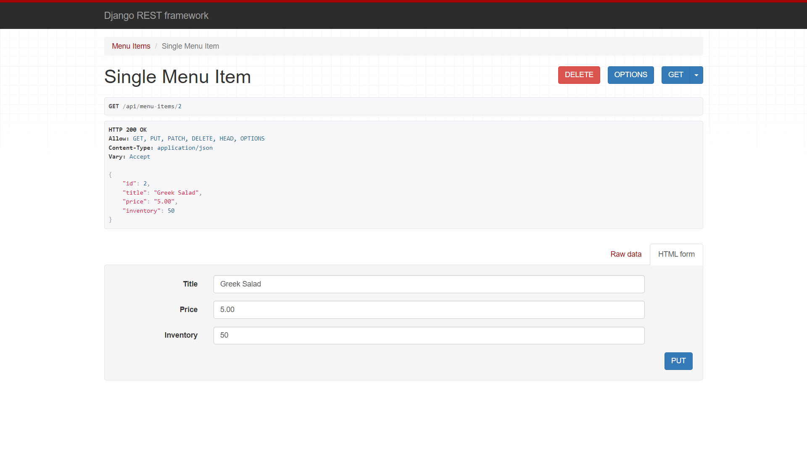
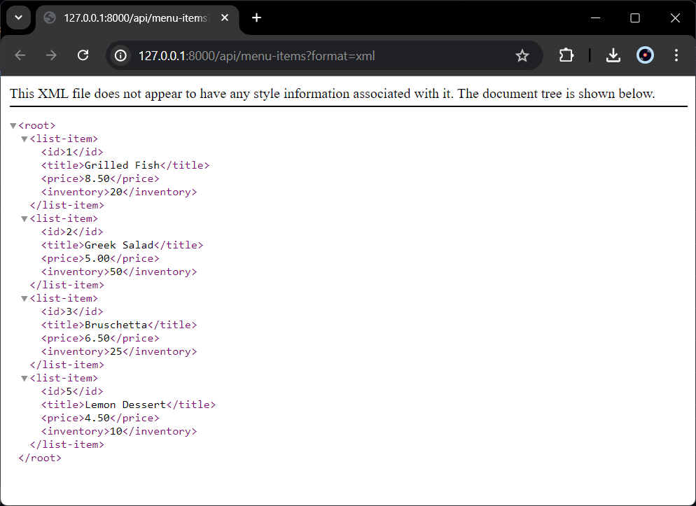
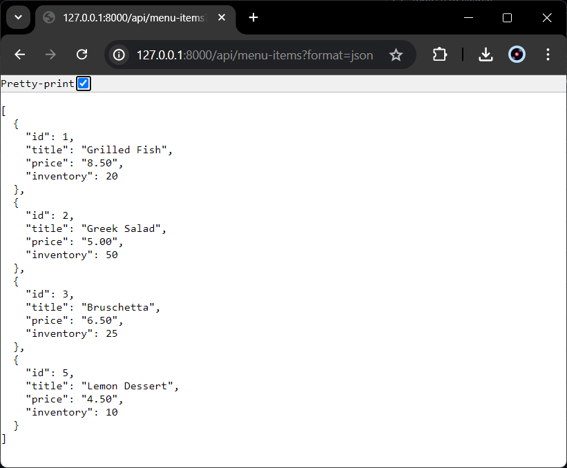

# Repository Untuk Eksplorasi Pembuatan Restaurant API Dengan Serializer Django REST Framework

```
Endpoint #1

http://127.0.0.1:8000/api/menu-items
```
.png)

```
Endpoint #2

http://127.0.0.1:8000/api/menu-items/4
```



```
Format lainnya

http://127.0.0.1:8000/api/menu-items?format=xml

```


```
http://127.0.0.1:8000/api/menu-items?format=json
```
